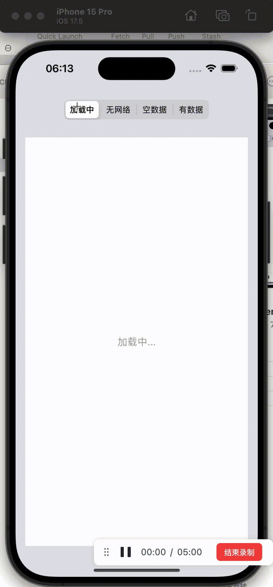

# PageState
PageState 关注的是页面状态的切换和状态视图在容器视图中的布局方式，不关心状态视图的具体内容。通过 PageState 可以很方便的管理视图各种状态之间的切换，比如「加载中」、「网络错误」、「空数据」等。

对 UIScrollView、UITableView、UICollectionView 进行扩展：
1. 有数据时自动隐藏，需调用`talewView.ps.realoadData()`；
2. 控制显示状态视图时是否可滑动；

## Example

To run the example project, clone the repo, and run `pod install` from the Example directory first.



## Requirements
- iOS 10.0+
- Xcode 10.0+
- Swift 4.2+

## Installation

PageState is available through [CocoaPods](https://cocoapods.org). To install
it, simply add the following line to your Podfile:

```ruby
pod 'PageState'
```

## Usage

1. 实现 `PageStateItem` 协议
```swift
// MARK: - 系统组件直接实现 PageStateItem 协议（不推荐）
// 为系统组件快速实现扩展，不实现的设置项使用默认值
// 不建议这么写
// 1. 会污染UILabel的命名空间
// 2. 无法PageStateItem设置项无法重写为存储属性，无法在外部修改
//extension UILabel: PageStateItem { 
//    // 布局改为居中，UILabel可以自约束宽高
//    public var layoutStyle: PageStateLayoutStyle {
//        return .center(offset: .zero)
//    }
//}

// MARK: - 子类化
class PSLabelItem: UILabel, PageStateItem {
    // 中心偏移量
    var layoutOffset: CGPoint = .zero

    // 布局改为居中，UILabel可以自约束宽高
    // 用计算属性，不让外部修改布局方式
    public var layoutStyle: PageStateLayoutStyle {
        return .center(offset: layoutOffset)
    }
    
    // 重写为存储属性，外部可修改
    var isScrollAllowed: Bool = false
    
    // 自定义快捷方法
    static func empty(text: String = "暂无数据") -> PSLabelItem {
        let label = PSLabelItem()
        label.font = .systemFont(ofSize: 16, weight: .regular)
        label.textColor = .lightGray
        label.text = text
        return label
    }
}`
```

2. 给容器视图设置各种状态
```swift
// 加载中
tableView.ps.item = PSLabelItem.empty(text: "加载中...")

// 使用 coning 方法设置属性
tableView.ps.item = PSLabelItem.empty(text: "加载中...")
    .config { item in
        item.layoutOffset = CGPoint(x: 0, y: -150)
    }

// 移除状态视图
tableView.ps.item = nil
```

更多使用说明请参考文档 [Usage](./Document/Usage.md) 或查看 Example

## Author

zhaoshouwen, zsw19911017@163.com

## License

PageState is available under the MIT license. See the LICENSE file for more info.
